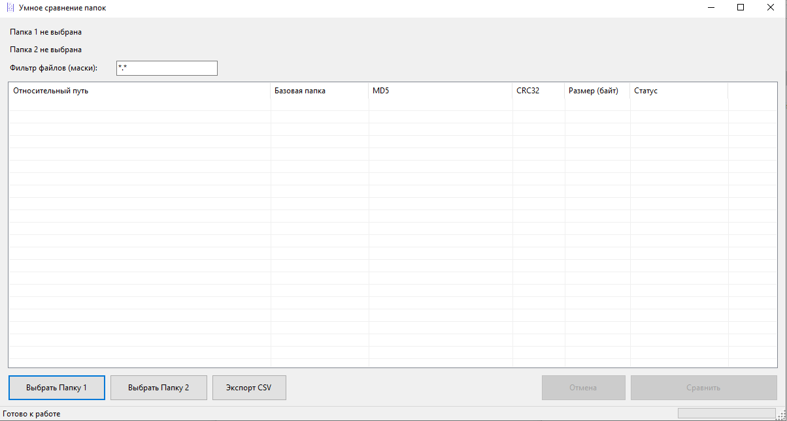

# 📂 Folder Checksum Comparer (.NET 10)


Легковесное, сверхбыстрое и отзывчивое Windows Forms приложение для рекурсивного сравнения двух директорий по контрольным суммам **MD5** и **CRC32**. 

Программа специально оптимизирована для работы на сверхбыстрых современных накопителях (NVMe SSD) и эффективно справляется со сравнением директорий объемом в сотни гигабайт.

---

## 🚀 Ключевые возможности

*   **Рекурсивное сравнение** папок любого уровня вложенности.
*   **Четкие статусы файлов**:
    *   `✅ Совпадают` — файлы идентичны по размеру и хешам.
    *   `❌ Разные размеры` — различие обнаружено мгновенно без чтения диска.
    *   `❌ Разные хеши` — размеры совпадают, но контент отличается.
    *   `Только в 'Папка'` — файл уникален для одной из директорий.
*   **Многопоточность (`Parallel.ForEach`)** — параллельный расчет хешей на всех доступных ядрах процессора.
*   **Гибкая фильтрация** — поддержка поиска по маскам файлов (например, `*.dll; *.exe; *.json; *.zip`).
*   **Удобный и отзывчивый интерфейс (UX)**:
    *   Двойная буферизация таблицы (`FlickerFreeListView`) полностью исключает мерцание при прокрутке и обновлении данных.
    *   Современный системный диалог выбора папок через COM-интерфейсы Windows API.
    *   Возможность плавной отмены операции в любой момент (`CancellationToken`).
    *   Отображение прогресса в статус-баре в реальном времени.
*   **Интеграция с системой**:
    *   Запуск файла напрямую двойным кликом по строке.
    *   Контекстное меню (ПКМ) для копирования путей, хешей или открытия папки с файлом в Проводнике.
*   **Экспорт отчетов** — сохранение результатов сравнения в подробный `.csv` файл.

---

## 🖼️ Скриншот программы



---

## ⚡ Оптимизации производительности (Под капотом)

Основная фишка проекта — **архитектура с минимальным выделением памяти (Zero-Allocation)** и упор на максимальную скорость I/O:

1.  **Однопроходное чтение (Single-pass hashing):** Файл считывается с диска в буфер ровно один раз. Вычисление MD5 и CRC32 происходит параллельно в рамках одного цикла чтения, что снижает нагрузку на диск в 2 раза по сравнению с последовательным расчетом.
2.  **Аппаратное ускорение CRC32:** Вместо медленного побайтового расчета на C# используется официальная библиотека `System.IO.Hashing`, задействующая векторные инструкции процессора (Intel SSE 4.2 / AVX) на аппаратном уровне.
3.  **Использование пула буферов (`ArrayPool<byte>`):** Программа не выделяет память под новые массивы (`new byte[]`) для каждого файла. Вместо этого арендуются крупные буферы (1 МБ) из общего пула среды выполнения. Это предотвращает фрагментацию кучи больших объектов (LOH) и снижает нагрузку на сборщик мусора (GC) практически до нуля.
4.  **Низкоуровневый I/O (`RandomAccess.Read`):** Вместо тяжелых абстракций вроде `FileStream` используется современное API работы напрямую с дескриптором файла ОС (SafeFileHandle) с флагом `SequentialScan`.
5.  **Работа с памятью через `Span<T>`:** Преобразование бинарных хешей в шестнадцатеричные строки (`Hex`) выполняется через выделение памяти в стеке (`stackalloc`) и метод `Convert.ToHexString()`, полностью исключая создание промежуточных объектов в куче.

---

## 💻 Требования

*   **Операционная система:** Windows 10 / Windows 11 (64-bit)
*   **Среда выполнения:** .NET 10.0 Runtime
*   **Среда разработки:** Visual Studio 2026 или Rider 2025+

---

## 🛠️ Установка и запуск

1.  Клонируйте репозиторий:
    ```bash
    git clone https://github.com/img507/Checksum.git
    ```
2.  Откройте решение `Checksum.sln` в Visual Studio.
3.  Установите необходимый NuGet-пакет через Консоль диспетчера пакетов:
    ```powershell
    Install-Package System.IO.Hashing
    ```
4.  Скомпилируйте проект в конфигурации **Release** для максимальной производительности.

---

## 📝 Разработчикам (Важно при тестировании производительности)

Если при сравнении папок на больших скоростях вы замечаете высокую нагрузку на процессор со стороны процесса **`Antimalware Service Executable` (Защитник Windows)**, добавьте вашу тестовую папку и исполняемый файл `Checksum.exe` в список исключений Windows Defender. 

Антивирус перехватывает массовые запросы чтения файлов, что искусственно занижает реальные показатели скорости дискового ввода-вывода вашей программы.

---